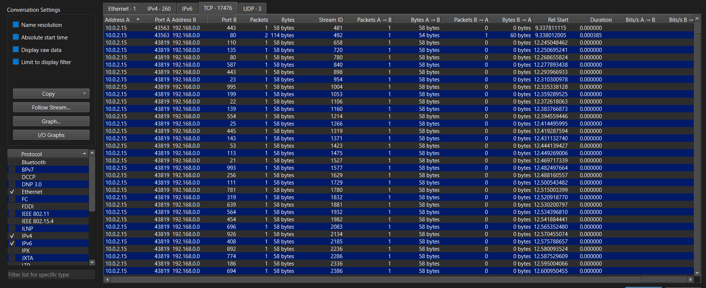
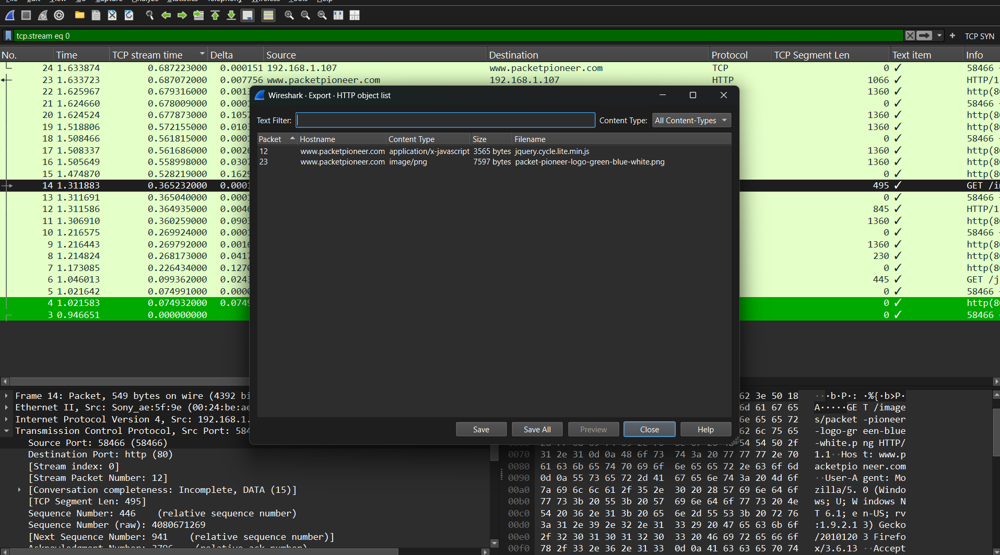
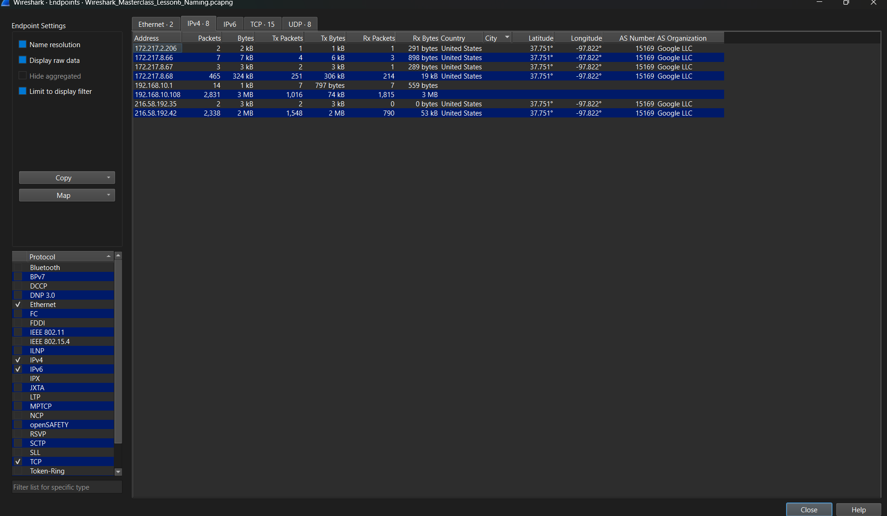
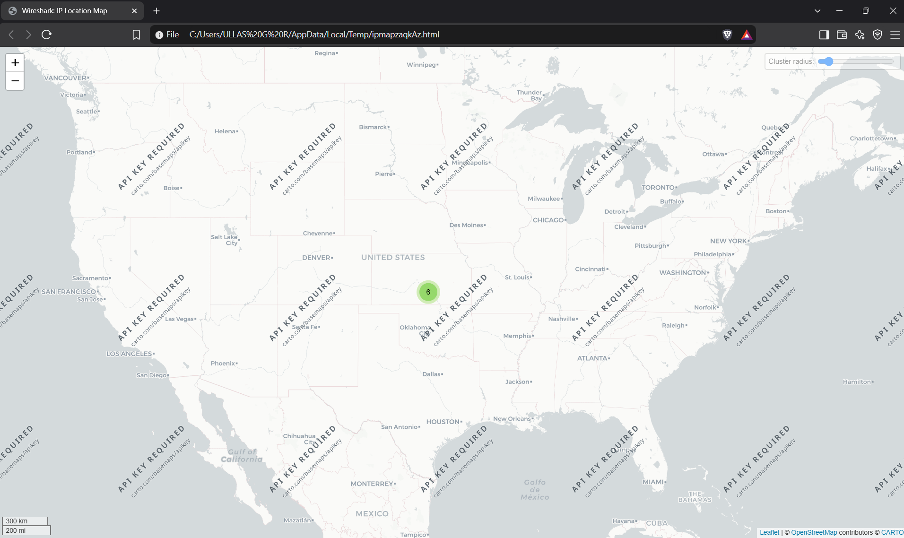
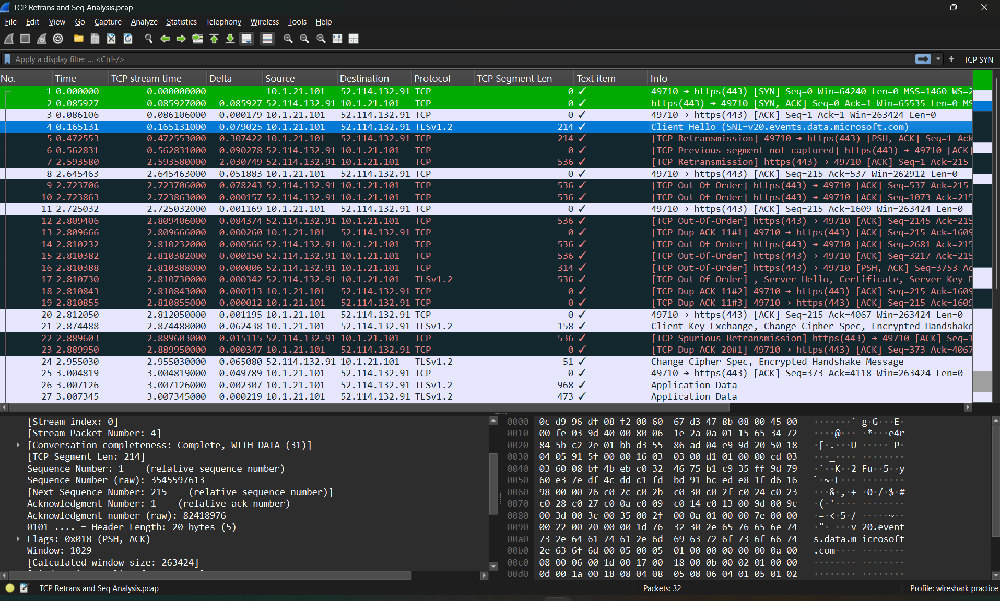
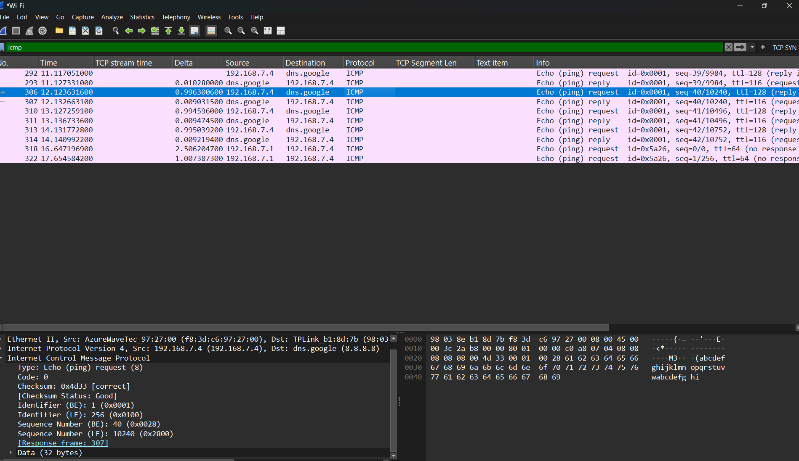
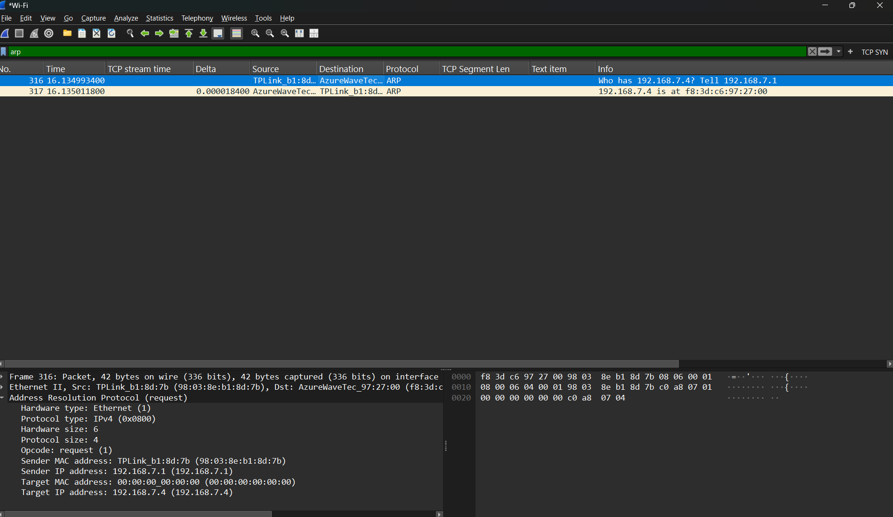

\# Wireshark Packet Capture


\## Objective


To learn how to capture and inspect network traffic using Wireshark and Dumpcap.


\## Tools Used


\- Wireshark

\- Dumpcap

\- Windows

\- Wi-Fi Network Interface


\## Practical Work


\### 1. GUI Packet Capture


\- Selected the Wi-Fi network interface in Wireshark.

\- Started a live packet capture.

\- Generated network traffic by accessing websites.

\- Stopped the capture and analyzed the packets.


\### 2. Packet Filtering


Practiced using Wireshark display filters:


\- `dns` — identify DNS traffic

\- `tcp` — identify TCP traffic

\- `udp` — identify UDP traffic

\- `tls` — identify TLS traffic

\- `tls.handshake.type == 1` — identify TLS Client Hello packets


\### 3. TLS Client Hello Analysis


Inspected TLS Client Hello packets and identified:


\- TLS version

\- Source IP address

\- Destination IP address

\- Server Name (SNI)

\- Supported versions

\- Cipher suites


\### 4. CLI Packet Capture


Used Dumpcap from the Windows Command Prompt.


```bash

dumpcap -D

```


Used this command to list available capture interfaces.


```bash

dumpcap -i 4 -w "path\\capture.pcapng"

```


Used the Wi-Fi interface to capture traffic and save it as a PCAPNG file.


\### 5. Ring Buffer


Practiced using Dumpcap's ring-buffer options:


```bash

\-b filesize:10000 -b files:3

```


This allows captured traffic to be divided into multiple files based on file size and the number of files to retain.


\## Key Learnings


\- Wireshark can capture and analyze network packets.

\- Different network interfaces capture different traffic.

\- Display filters help isolate specific protocols and packets.

\- DNS can reveal domain-resolution activity when it is visible.

\- TLS Client Hello packets can sometimes reveal the requested hostname through SNI.

\- TLS encrypts application data, so the actual contents are generally not visible in the capture.

\- Dumpcap can be used to capture traffic from the command line.

\- Ring buffers help manage long-running packet captures.


### 6. Time Analysis

Practiced using Wireshark's time-related features to understand the timing and sequence of network packets.

- **Time Display Formats** — Changed how packet timestamps are displayed.
- **Time Reference / Stopwatch** — Set a selected packet as a reference point to measure the time of subsequent packets.
- **Delta Time** — Shows the time gap between consecutive packets. It is useful for identifying delays or pauses between packets.
- **TCP Stream Time** — Shows the elapsed time from the beginning of a specific TCP stream. It is useful for analyzing the timeline of a single TCP conversation.

The screenshot demonstrates TCP stream time and Delta time while analyzing a specific TCP stream using:

```text
tcp.stream eq 0
```


### 7. Wireshark Statistics

Used Wireshark Statistics to get a high-level view of network activity in a packet capture.

- **Conversations** — Used to identify communication between hosts and observe packet and byte counts.
- **Relative Start** — Shows when a conversation started relative to the beginning of the capture.
- **Duration** — Shows how long a conversation lasted.
- **Packets and Bytes** — Can be sorted to identify conversations with higher packet or byte counts.
- **Apply as Filter** — Used a selected conversation to investigate its related packets.

Wireshark Statistics helps quickly identify interesting network activity before investigating individual packets.



### 8. Extracting Files from PCAPs

Practiced extracting transferred objects from a packet capture using Wireshark.

- **Export Objects** — Used `File → Export Objects → HTTP` to identify files transferred over HTTP.
- **Object List** — Reviewed the hostname, content type, file size, packet number, and filename of captured objects.
- **Save Extracted Objects** — Selected an object and saved it to the local system for further analysis.
- **Follow TCP Stream** — Used `Follow → TCP Stream` as another method to reconstruct and inspect the raw data exchanged within a TCP conversation.

File extraction can be useful during network investigations to identify and analyze files transferred between systems.



## 9. GeoIP Analysis

Configured MaxMind GeoIP databases in Wireshark to enrich public IP addresses with approximate geographic and network information.

### What I Learned

- Configured MaxMind GeoIP databases in Wireshark.
- Used the Endpoints view to identify the approximate country and city associated with public IP addresses.
- Analyzed latitude and longitude information provided by GeoIP.
- Viewed AS Number and AS Organization information.
- Used Wireshark's IP Location Map to visualize IP addresses geographically.
- Learned that IP geolocation provides an approximate location and should not be treated as an exact physical location.

### Screenshots





## 10. TCP Retransmissions and Network Troubleshooting

Analyzed TCP retransmissions and network-level connection issues using Wireshark.

### Practical Analysis

- Used `tcp.analysis.retransmission` to identify retransmitted TCP segments.
- Used `tcp.analysis.fast_retransmission` and `tcp.analysis.lost_segment` for additional TCP investigation.
- Examined Sequence and Acknowledgment Numbers.
- Identified TCP segments carrying application payload versus ACK-only packets.
- Reviewed RTO behavior and TCP retransmission timing.
- Investigated packet-size and MSS-related behaviour during TCP troubleshooting.




## 11. ICMP Analysis

Analyzed ICMP traffic generated by ping using Wireshark.

### Practical Analysis

- Used the `icmp` display filter.
- Identified Echo Requests and Echo Replies.
- Verified ICMP Type 8 (Echo Request) and Type 0 (Echo Reply).
- Examined source and destination IP addresses.
- Used ICMP traffic to understand host reachability and basic network reconnaissance patterns.




## 12. ARP Analysis

Analyzed ARP requests and replies to understand local network address resolution.

### Practical Analysis

- Used the `arp` display filter.
- Identified ARP Requests and ARP Replies.
- Examined Sender IP, Sender MAC, Target IP, and Target MAC.
- Investigated how unexpected ARP responses or MAC-address changes can be identified during security analysis.
- Learned the basic Wireshark indicators associated with ARP spoofing/poisoning.



## Conclusion

This practical exercise provided hands-on experience with network packet capture, filtering, and basic analysis using Wireshark and Dumpcap.

