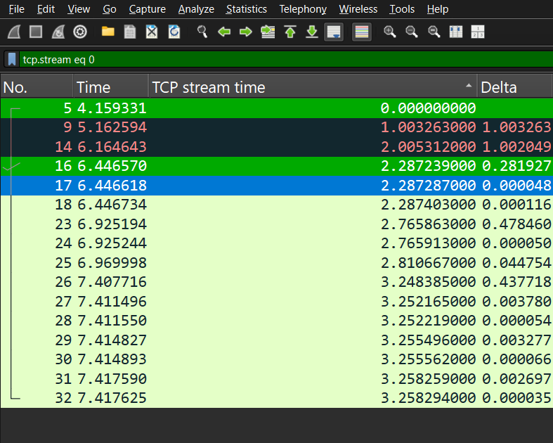

\# Wireshark Packet Capture


\## Objective


To learn how to capture and inspect network traffic using Wireshark and Dumpcap.


\## Tools Used


\- Wireshark

\- Dumpcap

\- Windows

\- Wi-Fi Network Interface


\## Practical Work


\### 1. GUI Packet Capture


\- Selected the Wi-Fi network interface in Wireshark.

\- Started a live packet capture.

\- Generated network traffic by accessing websites.

\- Stopped the capture and analyzed the packets.


\### 2. Packet Filtering


Practiced using Wireshark display filters:


\- `dns` — identify DNS traffic

\- `tcp` — identify TCP traffic

\- `udp` — identify UDP traffic

\- `tls` — identify TLS traffic

\- `tls.handshake.type == 1` — identify TLS Client Hello packets


\### 3. TLS Client Hello Analysis


Inspected TLS Client Hello packets and identified:


\- TLS version

\- Source IP address

\- Destination IP address

\- Server Name (SNI)

\- Supported versions

\- Cipher suites


\### 4. CLI Packet Capture


Used Dumpcap from the Windows Command Prompt.


```bash

dumpcap -D

```


Used this command to list available capture interfaces.


```bash

dumpcap -i 4 -w "path\\capture.pcapng"

```


Used the Wi-Fi interface to capture traffic and save it as a PCAPNG file.


\### 5. Ring Buffer


Practiced using Dumpcap's ring-buffer options:


```bash

\-b filesize:10000 -b files:3

```


This allows captured traffic to be divided into multiple files based on file size and the number of files to retain.


\## Key Learnings


\- Wireshark can capture and analyze network packets.

\- Different network interfaces capture different traffic.

\- Display filters help isolate specific protocols and packets.

\- DNS can reveal domain-resolution activity when it is visible.

\- TLS Client Hello packets can sometimes reveal the requested hostname through SNI.

\- TLS encrypts application data, so the actual contents are generally not visible in the capture.

\- Dumpcap can be used to capture traffic from the command line.

\- Ring buffers help manage long-running packet captures.


### 6. Time Analysis

Practiced using Wireshark's time-related features to understand the timing and sequence of network packets.

- **Time Display Formats** — Changed how packet timestamps are displayed.
- **Time Reference / Stopwatch** — Set a selected packet as a reference point to measure the time of subsequent packets.
- **Delta Time** — Shows the time gap between consecutive packets. It is useful for identifying delays or pauses between packets.
- **TCP Stream Time** — Shows the elapsed time from the beginning of a specific TCP stream. It is useful for analyzing the timeline of a single TCP conversation.

The screenshot demonstrates TCP stream time and Delta time while analyzing a specific TCP stream using:

```text
tcp.stream eq 0


## Conclusion


This practical exercise provided hands-on experience with network packet capture, filtering, and basic analysis using Wireshark and Dumpcap.

